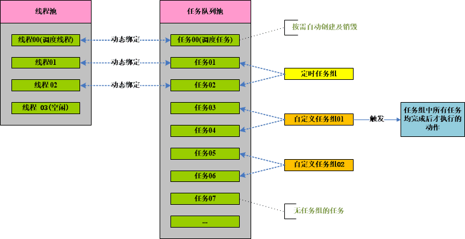
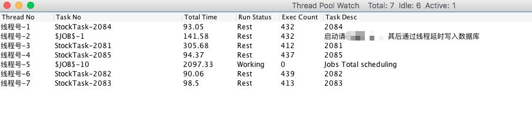

# hy.common.tpool





### 定时任务的代码样例（XML配置举例）
```xml
	<?xml version="1.0" encoding="UTF-8"?>
	
	<config>
	
		<import name="xconfig"         class="java.util.ArrayList" />
		<import name="job"             class="org.hy.common.thread.Job" />
		<import name="jobs"            class="org.hy.common.thread.Jobs" />
		
		
		
		<!-- 任务配置信息 -->
		<!-- $IntervalType_Second  间隔类型: 秒      -->
		<!-- $IntervalType_Minute  间隔类型: 分钟    -->
		<!-- $IntervalType_Hour    间隔类型: 小时    -->
		<!-- $IntervalType_Day     间隔类型: 天      -->
		<!-- $IntervalType_Week    间隔类型: 周      -->
		<!-- $IntervalType_Month   间隔类型: 月      -->
		<!-- $IntervalType_Manual  间隔类型: 手工执行 -->
		<xconfig>
			
		    <job id="定时任务的标识">
		    	<code>定时任务的标识</code>
		    	<name>定时任务的名称</name>
		    	<intervalType ref="this.$IntervalType_Minute"/>  <!-- 按分钟间隔执行 -->
		    	<intervalLen>10</intervalLen>                    <!-- 每10分钟执行一次 -->
		    	<startTime>2011-06-01 00:00:00</startTime>       <!-- 定时任务生效时间 -->
		    	<xjavaID>JavaClass</xjavaID>                     <!-- 定时任务执行哪个Java类 -->
		    	<methodName>JavaMethod</methodName>              <!-- 定时任务执行Java类中的哪个方法 -->
		    	<initExecute>true</initExecute>                  <!-- 初始化是否立即执行。默认为：false -->
		    </job>
		    
		    
		    
		    <jobs id="JOBS" this="JOBS">
		    	<addJob ref="定时任务的标识01" />                  <!-- 将定时任务添加到任务池中 -->
		    	<addJob ref="定时任务的标识02" />
		    	<addJob ref="定时任务的标识n"  />
		    	
		    	<call name="startup" />                          <!-- 启动定时任务的调度任务 -->
		    </jobs>
			
		</xconfig>
		
	</config>
```


### 自定义任务及执行
```java
	/**
	 * 自定义任务
	 */
	public class MyTask extends Task
	{
		private static int $SerialNo = 0;
	

		private synchronized int GetSerialNo()
		{
			return ++$SerialNo;
		}
		
		

		public MyTask() 
		{
			super("任务类型标识");
		}


		@Override
		public void execute() 
		{
			try
			{
				// 自定义任务执行的动作
			}
			catch (Exception exce)
			{
				exce.printStackTrace();
			}
			finally
			{
				this.finishTask();
			}
		}

		
		@Override
		public int getSerialNo() 
		{
			return GetSerialNo();   // 任务的序号
		}

		
		
		@Override
		public String getTaskDesc() 
		{
			return "任务的描述信息";
		}
		
	}
	
	
	
	public static void main(String [] args)
	{
		TaskGroup v_TaskGroup = new TaskGroup("任务组标识");
		
		for (int v_Index=0; v_Index<100; v_Index++)
		{
			v_TaskGroup.addTask(new MyTask());      // 将任务添加到任务组中
		}
		v_TaskGroup.startupAllTask();               // 执行任务组
	}
```


### 线程池参数配置
```java
	// 以下均为默认值
	ThreadPool.setMaxThread(100);       // 线程池中最大线程数
	ThreadPool.setMinThread(10);        // 线程池中最小线程数
	ThreadPool.setMinIdleThread(2);     // 线程池中最小空闲线程数
	ThreadPool.setIntervalTime(1000L);  // 等待时间间隔(单位：毫秒)
	ThreadPool.setIdleTimeKill(60L);    // 空闲多少时间后线程自毁(单位：秒)
```


### 打开线程池监控界面
```java
	ThreadPool.setWatch(true);          // 默认为：false
```



引用 https://github.com/HY-ZhengWei/hy.common.base 类库