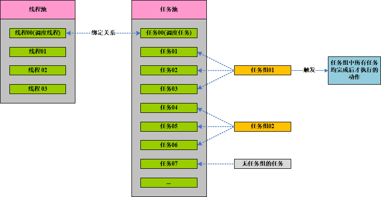

# hy.common.tpool





### 定时任务的代码样例（XML配置举例）
```xml
	<?xml version="1.0" encoding="UTF-8"?>
	
	<config>
	
		<import name="xconfig"         class="java.util.ArrayList" />
		<import name="job"             class="org.hy.common.thread.Job" />
		<import name="jobs"            class="org.hy.common.thread.Jobs" />
		
		
		
		<!-- 任务配置信息 -->
		<!-- $IntervalType_Second  间隔类型: 秒      -->
		<!-- $IntervalType_Minute  间隔类型: 分钟    -->
		<!-- $IntervalType_Hour    间隔类型: 小时    -->
		<!-- $IntervalType_Day     间隔类型: 天      -->
		<!-- $IntervalType_Week    间隔类型: 周      -->
		<!-- $IntervalType_Month   间隔类型: 月      -->
		<!-- $IntervalType_Manual  间隔类型: 手工执行 -->
		<xconfig>
			
		    <job id="定时任务的标识">
		    	<code>定时任务的标识</code>
		    	<name>定时任务的名称</name>
		    	<intervalType ref="this.$IntervalType_Minute"/>  <!-- 按分钟间隔执行 -->
		    	<intervalLen>10</intervalLen>                    <!-- 每10分钟执行一次 -->
		    	<startTime>2011-06-01 00:00:00</startTime>       <!-- 定时任务生效时间 -->
		    	<xjavaID>JavaClass</xjavaID>                     <!-- 定时任务执行哪个Java类 -->
		    	<methodName>JavaMethod</methodName>              <!-- 定时任务执行Java类中的哪个方法 -->
		    	<initExecute>true</initExecute>                  <!-- 初始化是否立即执行。默认为：false -->
		    </job>
		    
		    
		    
		    <jobs id="JOBS" this="JOBS">
		    	<addJob ref="定时任务的标识01" />
		    	<addJob ref="定时任务的标识02" />
		    	<addJob ref="定时任务的标识n"  />
		    	
		    	<call name="startup" />
		    </jobs>
			
		</xconfig>
		
	</config>
```


引用 https://github.com/HY-ZhengWei/hy.common.base 类库