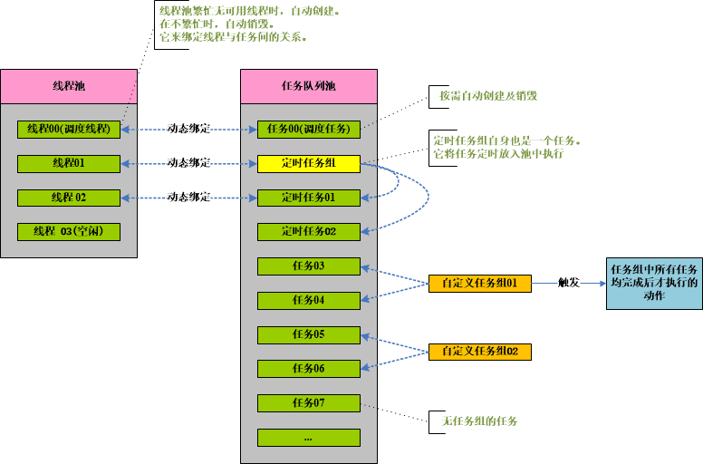
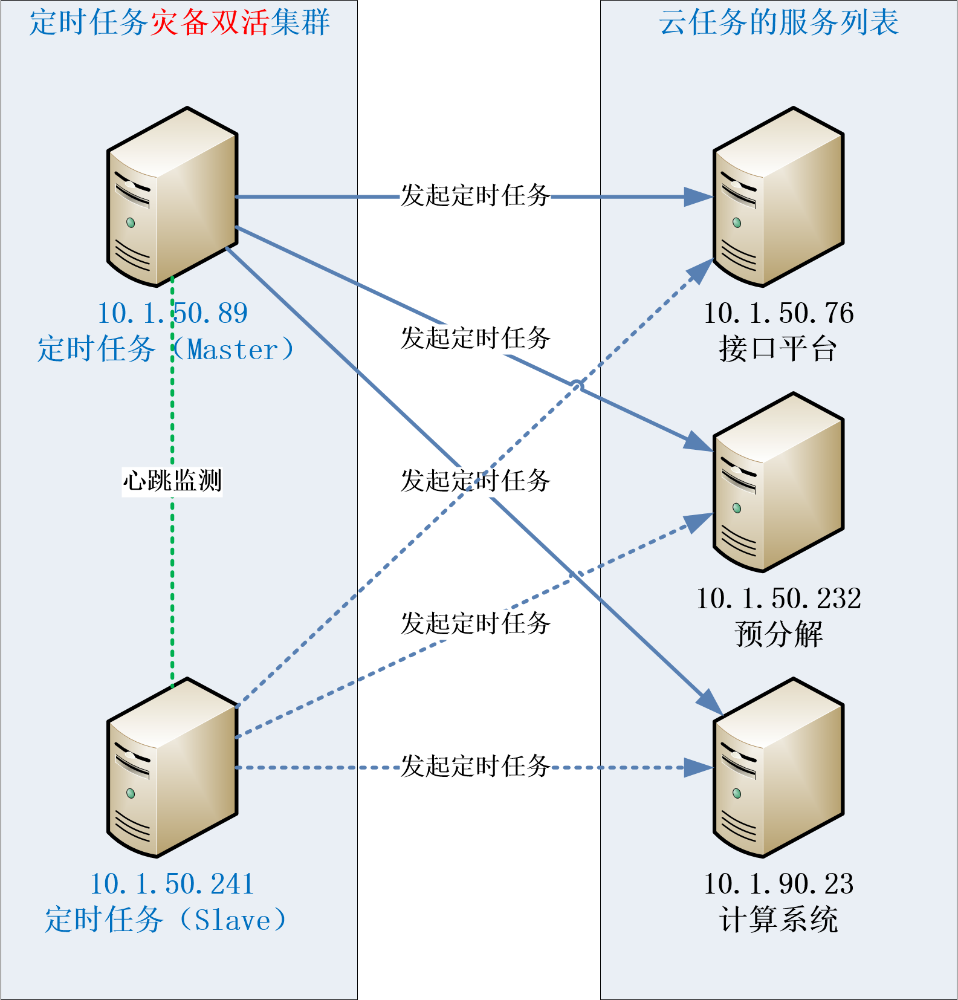

# hy.common.tpool





### 定时任务的代码样例（XML配置举例）
```xml
<?xml version="1.0" encoding="UTF-8"?>

<config>

	<import name="xconfig"         class="java.util.ArrayList" />
	<import name="job"             class="org.hy.common.thread.Job" />
	<import name="jobs"            class="org.hy.common.thread.Jobs" />
	<import name="servers"         class="java.util.ArrayList" />
	<import name="server"          class="org.hy.common.net.ClientSocket" />
	
	
	
	<!-- 任务配置信息 -->
	<xconfig>
		
	    <job id="定时任务的标识">
	    	<code>定时任务的标识</code>
	    	<name>定时任务的名称</name>
	    	<intervalType ref="this.$IntervalType_Minute"/>  <!-- 按分钟间隔执行 -->
	    	                                                 <!-- $IntervalType_Second  间隔类型: 秒      -->
	    	                                                 <!-- $IntervalType_Minute  间隔类型: 分钟    -->
	    	                                                 <!-- $IntervalType_Hour    间隔类型: 小时    -->
	    	                                                 <!-- $IntervalType_Day     间隔类型: 天      -->
	    	                                                 <!-- $IntervalType_Week    间隔类型: 周      -->
	    	                                                 <!-- $IntervalType_Month   间隔类型: 月      -->
	    	                                                 <!-- $IntervalType_Manual  间隔类型: 手工执行 -->
	    	<intervalLen>10</intervalLen>                    <!-- 每10分钟执行一次 -->
	    	<startTime>2011-06-01 00:00:00</startTime>       <!-- 定时任务生效时间。多个开始时间用分号分隔 -->
	    	<xid>JavaClass</xid>                             <!-- 定时任务执行哪个Java类 -->
	    	<methodName>JavaMethod</methodName>              <!-- 定时任务执行Java类中的哪个方法 -->
	    	<initExecute>true</initExecute>                  <!-- 初始化是否立即执行。默认为：false。可选的 -->
	    	<condition><![CDATA[:MI != 2]]></condition>      <!-- 执行条件：不等于2分时才允许执行任务。可选的 -->
	    	                                                 <!-- 执行条件的占位符：年份(:Y) -->
	    	                                                 <!-- 执行条件的占位符：月份(:M) -->
	    	                                                 <!-- 执行条件的占位符：日期(:D) -->
	    	                                                 <!-- 执行条件的占位符：小时(:H) -->
	    	                                                 <!-- 执行条件的占位符：分钟(:MI) -->
	    	                                                 <!-- 执行条件的占位符：秒钟(:S) -->
	    	                                                 <!-- 执行条件的占位符：年月日(:YMD)，格式为YYYYMMDD 样式的整数类型 -->
	    	<cloudServer>192.168.1.100:2021</cloudServer>    <!-- 云服务上地址及端口。表示执行云端服务器上的任务。可选的 -->
	    </job>
	    
	    
	    <!-- 灾备机制的服务列表。可选的 -->
	    <servers id="DisasterRecoverys">
	    	<server>
	        	<constructor>
       				<String>192.168.1.101</String>
       				<int>9021</int>
	        	</constructor>
        	</server>
        	
        	<server>
	        	<constructor>
       				<String>192.168.1.102</String>
       				<int>9021</int>
	        	</constructor>
        	</server>
	    </servers>
	    
	    
	    <jobs id="JOBS" this="JOBS">
	    
	    	<disasterRecoverys ref="DisasterRecoverys" />    <!-- 灾备机制的服务列表。可选的 -->
	    	
	    	<call name="shutdown" />                         <!-- 停止所有定时任务。预防多次重复加载时的异常 -->
    		<call name="delJobs" />                          <!-- 删除所有定时任务。预防多次重复加载时的异常 -->
    	
	    	<addJob ref="定时任务的标识01" />                  <!-- 将定时任务添加到任务池中 -->
	    	<addJob ref="定时任务的标识02" />
	    	<addJob ref="定时任务的标识n"  />
	    </jobs>
	    
	    
	    <!-- 开启定时任务 -->
	    <jobs id="JOBS" this="JOBS">
    		<call name="startup" />
	    </jobs>
		
	</xconfig>
	
</config>
```


### 自定义任务及执行的代码样例
```java
	/**
	 * 自定义任务
	 */
	public class MyTask extends Task<Object>
	{
		private static int $SerialNo = 0;
	

		private synchronized int GetSerialNo()
		{
			return ++$SerialNo;
		}
		

		public MyTask() 
		{
			super("任务类型标识");
		}


		@Override
		public void execute() 
		{
			try
			{
				// 自定义任务执行的动作
			}
			catch (Exception exce)
			{
				exce.printStackTrace();
			}
			finally
			{
				this.finishTask();  // 任务执行完成。如果不执行此方法：表示任务将循环往复的一直执行下去
			}
		}

		
		@Override
		public int getSerialNo() 
		{
			return GetSerialNo();   // 任务的序号
		}

		
		@Override
		public String getTaskDesc() 
		{
			return "任务的描述信息";
		}
	}
	
	
	
	/**
	 * 执行方式01：将任务组织成任务组后再执行
	 */
	public static void main(String [] args)
	{
		TaskGroup v_TaskGroup = new TaskGroup("任务组标识");
		
		for (int v_Index=0; v_Index<100; v_Index++)
		{
			v_TaskGroup.addTask(new MyTask());      // 将任务添加到任务组中
		}
		
		v_TaskGroup.addTaskGroupListener(...);      // 实现TaskGroupListener接口后，可在任务均完成时触发指定动作（可选的）
		v_TaskGroup.startupAllTask();               // 执行任务组
	}
	
	
	
	/**
	 * 执行方式02：任务直接由线程池来执行
	 */
	public static void main(String [] args)
	{
		ThreadPool.getThreadInstance(new MyTask()).startupAndExecuteTask();
	}
```


### 线程池参数配置
```java
	// 以下均为默认值
	ThreadPool.setMaxThread(100);       // 线程池中最大线程数
	ThreadPool.setMinThread(10);        // 线程池中最小线程数
	ThreadPool.setMinIdleThread(2);     // 线程池中最小空闲线程数
	ThreadPool.setIntervalTime(1000L);  // 等待时间间隔(单位：毫秒)
	ThreadPool.setIdleTimeKill(60L);    // 空闲多少时间后线程自毁(单位：秒)
```


### 桌面版：线程池监控界面
```java
	ThreadPool.setWatch(true);          // 默认为：false
```


### 网页版：线程池监控界面（支持集群）
访问网址格式为：http://IP:Port/服务名/analyses/analyseObject?ThreadPool=Y&cluster=Y


### 定时任务的监控界面
访问网址格式为：http://IP:Port/服务名/analyses/analyseObject?Job=Y


### 定时任务灾备双活集群（支持云任务）：总统模式
1. 定时任务的灾备集群由2台或多台服务组成。

2. 多台定时任务服务器工作时，在同一时间，只有一台Master服务有权执行任务。其它服务为Slave服务，没有执行任务的权限。

3. 当原Master50.89宕机时，50.241自动接管执行任务的权限，成为新的Master服务。

4. 当原Master50.89只时暂时无法访问时（如网络原因），服务本是正常时，50.241先自动接管执行任务的权限，暂时成为新的Master服务，当50.89网络恢复时，再将执行权限还给50.89。

5. 多台定时任务服务间，每1分钟监测一次心跳。

6. 当连续心跳3次（数量可配置）均发现原Master服务异常时，才进行权限转移动作。

7. 为了保证Master服务的性能，只有其它Slave服务对整体集群做心跳监测。Master服务不再对其它Slave服务做心跳监测。

下面的组网图，为某项目的实战组网结构。



### 定时任务灾备双活集群服务的监控页面


---
#### 本项目引用Jar包，其源码链接如下
引用 https://github.com/HY-ZhengWei/hy.common.net 类库

引用 https://github.com/HY-ZhengWei/hy.common.base 类库